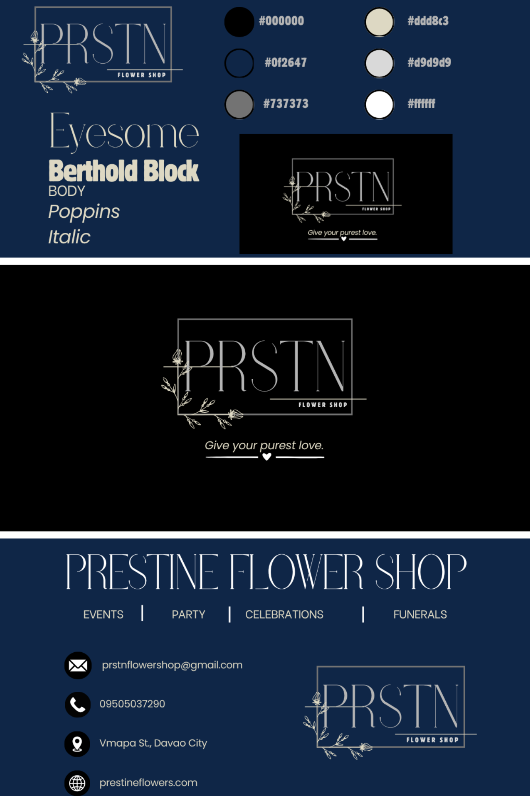

# ˚₊‧꒰ა 🔤 THE ART OF TYPOGRAPHY ໒꒱ ‧₊˚

> ✨ *Where Elegant Letters Meet Clear Communication* ✨

---

## 🖼️ Typography Reference

## 🌸 My Typography Selection

For the PRSTN Flower Shop branding, I selected typography that combines **elegance, sophistication, and readability**.

The fonts were chosen to reflect the identity of a flower shop while keeping the design clean and visually appealing.

---

## ✨ Eyesome

### 🌷 Main Display Font

**Eyesome** is used for the main brand name and large headings.

I selected this font because of its **elegant, thin, and sophisticated appearance**. Its unique letterforms create a luxurious and artistic feeling, which fits the floral concept of PRSTN Flower Shop.

> 💡 *Eyesome gives the brand its elegant and premium personality.*

---

## 🖤 Berthold Block

### 🔥 Bold Emphasis Font

**Berthold Block** is used for important words and text that need strong emphasis.

I chose this font because its bold appearance creates a strong contrast with the thin and elegant Eyesome font.

> 💡 *The bold typography helps important information stand out.*

---

## 🔤 Poppins

### 📖 Body and Supporting Font

**Poppins** is used for body text and supporting information.

I selected Poppins because it is **clean, modern, and easy to read**.

Since Eyesome and Berthold Block are mainly used for visual personality and emphasis, Poppins helps maintain readability throughout the design.

> 💡 *Poppins balances creativity with clear communication.*

---

## ✍️ Italic Style

### 🌿 Supporting Text Style

Italic styling is used for selected supporting text and decorative phrases.

This style adds a **soft and elegant touch** while creating variation in the typography.

---

## 🎨 Why I Chose These Fonts

The combination of these fonts creates a balanced typography system:

| Font | Purpose | Design Feeling |
|---|---|---|
| ✨ Eyesome | Brand name and headings | Elegant and sophisticated |
| 🖤 Berthold Block | Important text and emphasis | Bold and strong |
| 🔤 Poppins | Body and supporting text | Clean and readable |
| ✍️ Italic | Decorative/supporting text | Soft and elegant |

---

## 🌸 Typography Reflection

I chose these fonts because I wanted PRSTN Flower Shop to have an identity that feels **elegant, minimalist, and sophisticated**.

The combination of an elegant display font, a bold emphasis font, and a clean body font creates contrast while keeping the design organized and readable.

✨ **Typography is not only about choosing beautiful fonts—it is also about helping the audience understand the message clearly.** ✨
