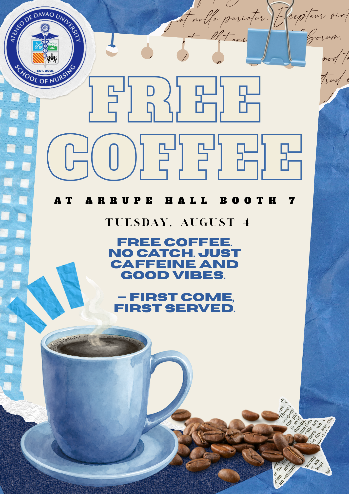

# 🎨 Activity 1: Presentation Design Principles

## ˚₊‧꒰ა 🖼️ FINAL OUTPUT ໒꒱ ‧₊˚

> ✨ *My completed Free Coffee promotional design!* ✨

## 💡 Concept

The concept was inspired by the warm and inviting atmosphere associated with coffee. I wanted the design to immediately catch attention while still maintaining a clean and organized composition.

## 🎯 Design Principles Applied

- **Contrast** – Dark blue and cream colors create strong visual contrast.
- **Hierarchy** – “FREE COFFEE” is the largest and strongest visual element.
- **Emphasis** – The main promotional message is placed at the center.
- **Balance** – The coffee cup, beans, text, and decorations are distributed to create visual balance.
- **Repetition** – Blue tones are repeated throughout the composition.
- **Alignment** – Text and visual elements are arranged to improve readability.

## ✨ How the Principles Improved the Design

Applying these principles helped the presentation become more visually appealing, organized, and easy to understand. The audience can quickly identify the main message and supporting information.
